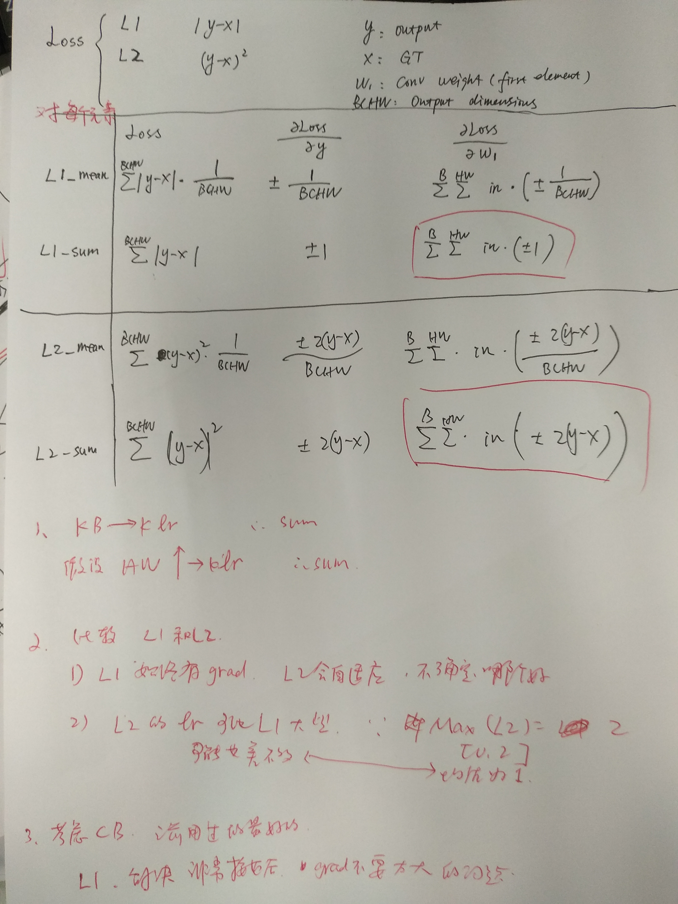

=====================
loss的问题
=====================

.. code-block:: python3

    import torch
    import torch.nn as nn
    import torch.nn.init as init
    import torch.nn.functional as F

    B = 3
    H = 10
    W = 10
    fea_in = torch.ones(B, 4, H, W)  # [B, 4, H, W], 1
    GT = torch.ones(B, 3, H - 2, W - 2) * 20  # [B, 3, H, W], 20

    # convolution
    conv = nn.Conv2d(4, 3, 3)
    conv.weight.data.fill_(0.5)  # [3, 4, 3, 3], 0.5
    conv.bias.data.fill_(0)

    fea_out = conv(fea_in)  # [B, 3, H-2, W-2], 18

    # By default, gradients are only retained for leaf variables. non-leaf variables’ gradients are not
    # retained to be inspected later. This was done by design, to save memory.
    fea_out.register_hook(print)

    ## L1 loss - mean
    L1Loss_mean = torch.nn.L1Loss(reduction='mean')
    loss = L1Loss_mean(fea_out, GT)  # average for each element, loss = 2
    loss.backward()
    print(loss)
    print(conv.weight.grad[0])

    '''
    Loss = 1/N * SUM(|GT - fea_out|), N = B*C_out*H*W
    d(Loss)/d(fea_out) = 1/N * -1 = -1/(3*3*8*8) for each element.

    The gradients w.r.t weights:
    w1: one element in weights.

    forward: SUM_B(SUM_HW(w1 * in))
    d(fea_out)/d(w1) = SUM_B(SUM_HW(in))

    d(Loss)/d(w1) = d(Loss)/d(fea_out) * d(fea_out)/d(1)
                = SUM_B(SUM_HW(in * grad_))
                = -1/3
    After update: w1 - (-1/3) = w1 + 1/3
    The weights will be larger, so the outputs will close to 20
    '''

    # L1 loss - sum
    # L1Loss_sum = torch.nn.L1Loss(reduction='sum')
    # loss = L1Loss_sum(fea_out, GT)
    # loss.backward()
    # print(loss)
    # print(conv.weight.grad[0])

    # L2 loss (MSE) - mean
    # L2Loss_mean = torch.nn.MSELoss(reduction='mean')
    # loss = L2Loss_mean(fea_out, GT)
    # loss.backward()
    # print(loss)
    # print(conv.weight.grad[0])

    # L2 loss (MSE) - sum
    # L2Loss_sum = torch.nn.MSELoss(reduction='sum')
    # loss = L2Loss_sum(fea_out, GT)
    # loss.backward()
    # print(loss)
    # print(conv.weight.grad[0])

loss gradients比较
=====================

    This is the caption of the figure (a simple paragraph).

:Created: 2019/01/09
